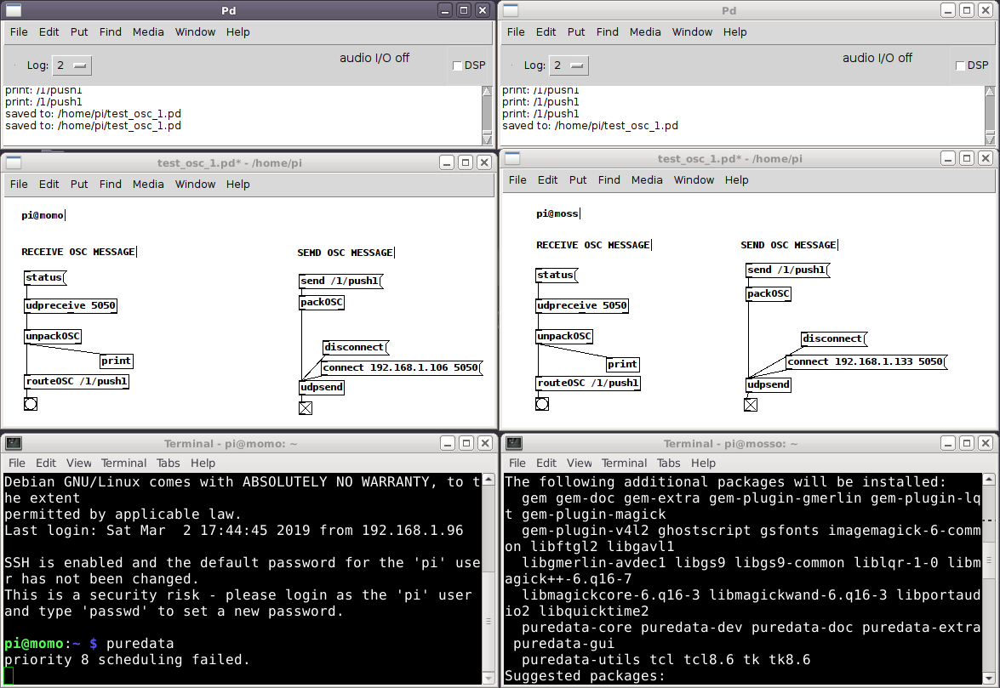
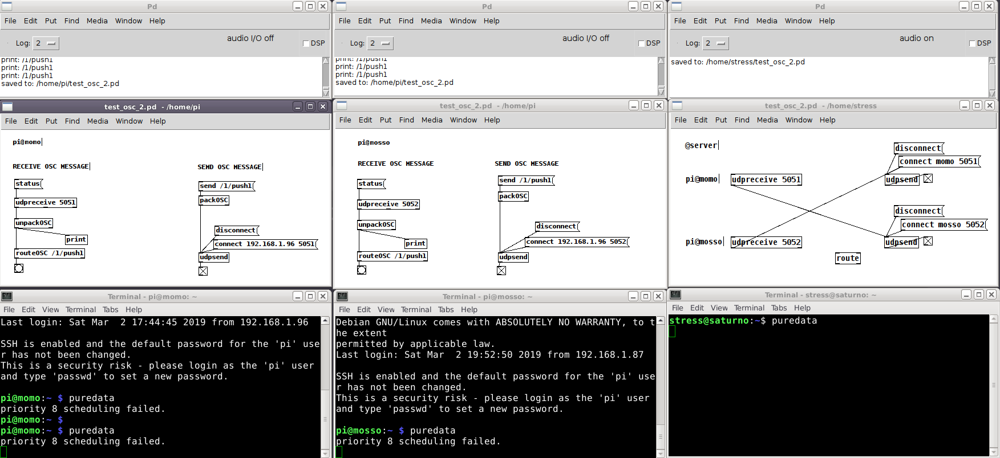
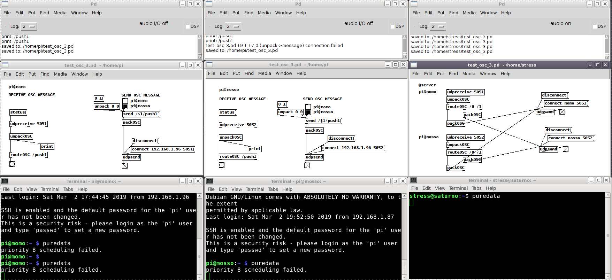
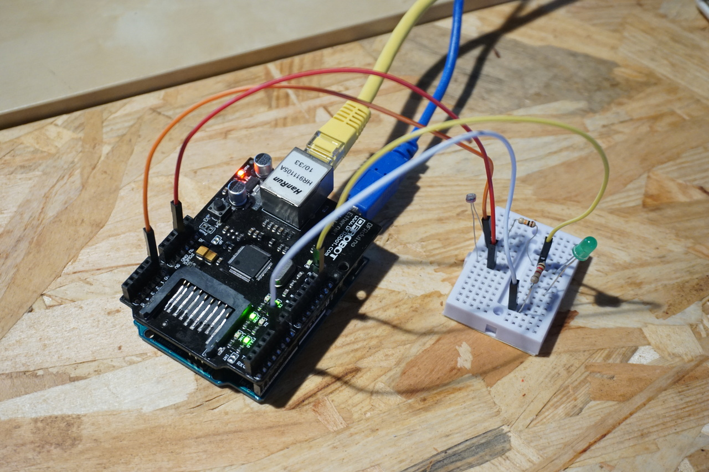
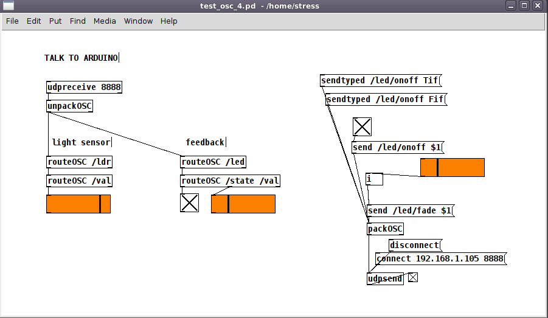

# OSC - Open Sound Control

Example code and pd patches are available at github: https://github.com/lxmill/osc-party/

## OSC + Pure Data + Raspberry Pi

### Setting up Pure Data + OSC on the Raspberry Pi
```
  apt-get update
  apt-get install puredata
  apt-get install pd-mrpeach pd-mrpeach-net pd-osc
```
after installing, add extra folders to path:  
`file > preferences > path > new > /usr/lib/pd/extra` and select `mrpeach`, `net` and `osc` folders  

### Example 1 : Direct messages between two machines

  

Neste exemplo temos dois raspberrypi ligados à mesma rede.  

Cada uma das máquinas envia e recebe mensagens de osc através de `udpsend` e `udpreceive`, criadas pelos objetos osc da biblioteca pd-osc.  

In this example we have two raspberries connected to the same netweork  

Each one receives OSC messages via `udpsend` and `udpreceive`, provided by the osc objects of the pd-osc library.  

### Example 2 : Talking through a server

  

Dois raspberrypi ligados a um servidor através da mesma rede.  

Cada uma das máquinas envia e recebe mensagens de osc através de `udpsend` e `udpreceive` através do servidor-  

No servidor é feita a ligação directa entre `udpreceive` e `udpsend` podendo escolher o routing de ligação entre os pi.  

Two raspberries connected to each other via a central server.  

Each of the machines receive OSC messages via `udpsend` and `udpreceive` via the server.  

On the server the connections between `udpreceive` and `udpsend` are used to route messages between the the two pi's 

### Example 3 : Talking through a server and choosing destinations

  

Dois raspberrypi ligados a um servidor através da mesma rede.  

Cada uma das máquinas envia e recebe mensagens de osc através de `udpsend` e `udpreceive` através do servidor-  

Cada um dos pis define para onde que máquina quer enviar mensagem e o servidor faz esse routing com `routeOSC`, primeira ramo da árvore osc.

Two raspberries connected to each other via a central server.  

Each of the machines receive OSC messages via `udpsend` and `udpreceive` via the server.  

In this case each the patch running on each pi can address the messages and the server will route them automatically using `routeOSC`, using the first parameter of the osc message path.

## OSC + Pure Data + Arduino

### Example 1 : Sending/receiving via ethernet


  
  

In this example the we can control the state of an LED on the arduino via pure data, and receive values from the LDR light sensor.  

OSC messages are sent from the arduino using the [OSC for Arduino](https://github.com/CNMAT/OSC) library, and using the `EthernetUDP` object from the Ethernet library.

In this case, the arduino will send osc messages to the source of the messages it receives, using `udp.remoteIP()`. When the sketch starts, the arduino will not have a destination for the stream of ldr readings until it receives a message.

We also tested this with the Adafruit Feather M0 Adalogger + Ethernet Wing.


  

### Example 2 : Sending/receiving via wifi with esp8266


  

This example is the same, except communication is over wifi using the Adafruit Feather ESP8266.  This time we are also sending messages from the Feather to a defined IP, set with the `remote_ip` variable.


----


## LINKS

### OPEN SOUND CONTROL
http://opensoundcontrol.org/introduction-osc

### OSC for Arduino
OSC encoding library for Arduino  
https://github.com/CNMAT/OSC

### OSC for Python
OSC python module  
https://github.com/attwad/python-osc

### Sensors2OSC
Android application that can stream sensor data, including multitouch data, via OSC.  
https://sensors2.org/osc/

### Bydcontrol
Android application that cand send and receive osc messages, and allows creation of custom interfaces.  
https://www.mobilemerc.com/projects/bydcontrol/

### MobMuPlat - Mobile Music Platform
Tool for creating an interface for pd that can be exported for an android device.  
http://www.danieliglesia.com/mobmuplat/

### H E X L E R - TouchOSC
A modular OSC and MIDI control surface for iOS and Android.  
https://hexler.net/docs/touchosc

### TouchOSC and OSCuino
Tutorial for controlling an Arduino with TouchOSC.  
https://trippylighting.com/teensy-arduino-ect/touchosc-and-arduino-oscuino/

### SOUNDCOOL
System for music education and collaborative creation using smartphones, tablets, Kinect, Open Sound Control (OSC) and MAX / MSP / Jitter  
http://soundcool.org/