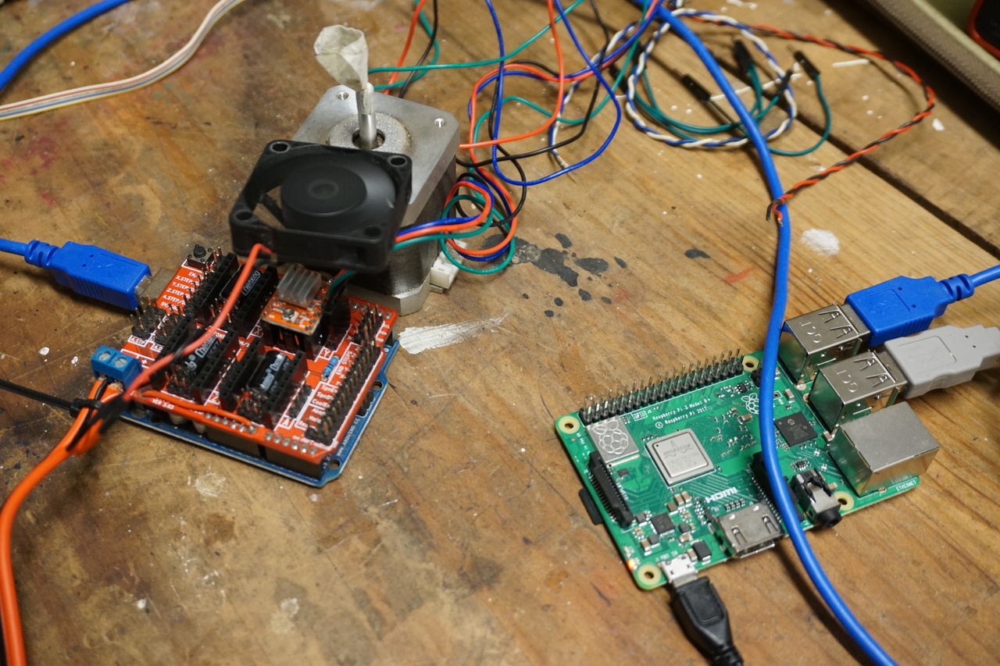
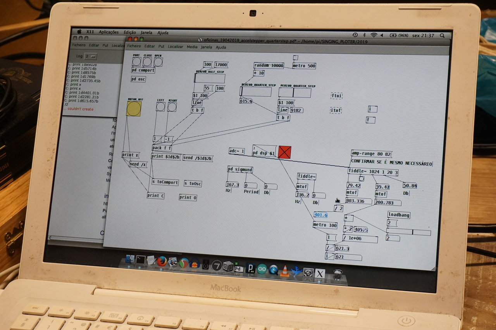

# Singing Plotter: Translating Between Sound and Motion

We are experimenting with driving stepper motors on the basis of sound, by analysing the sound frequencies produced by the motor at different pulse width and microstepping configurations.  

We would like to use this to drive a plotter based on the live sound input captured by microphone, such as voice, or the sounds from the machine itself to create feedback loops.  We think it could be interesting to explore the performative use of a drawing machine or the stepper motors of other machines in this way.  

[GitHub Repository](https://github.com/tiago-rorke/singing-plotter)  

  

  
_NEMA 17 stepper motor with microphone_  

  
_Pure Data running Raspberry Pi 3, and arduino Uno with GRBL shield and A4988 stepper driver_  
