# MORGAN // Resident Plotter at Maus Hábitos

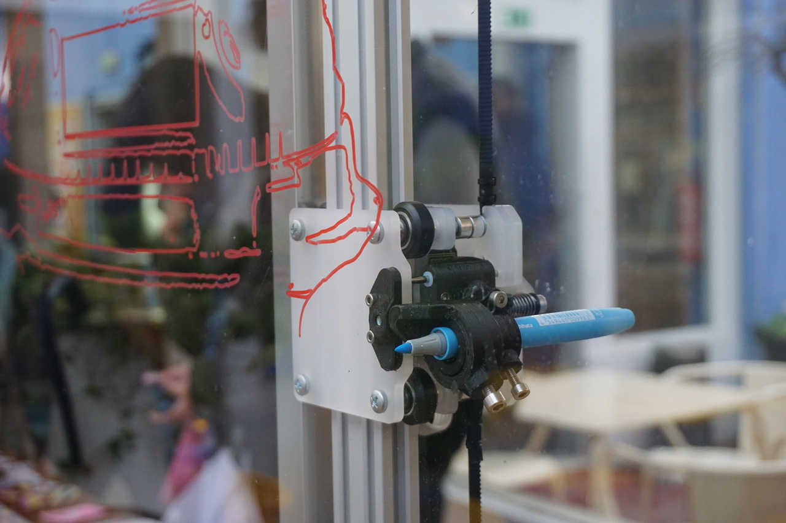

---

## GLOSSARY

### G-code
This is the file that contains your drawing in a format the machine can understand and reproduce.  This G-code data is also known as the toolpath.

### Toolhead
This is the part of the machine that holds and moves the pen.

### Home (Machine Zero)
When the machine is switched on, it does not know where the toolhead is.  This is why we first have to move the toolhead to the home position so that the machine has a zero point reference.  This is called 'Home' or 'Machine Zero'.

### Work Zero
This is where we want to put the origin of our drawing, which is defined in Inkscape by the left-most orientation point.  Generally this should be at (0,0) in Inkscape.

### Jog Controls
These are arrow keys/commands let you move the toolhead in real-time.

### Raspberry Pi
This is a small computer inside Morgan running Linux.  It has it's own on/off switch, separate from the red emergency stop button.  
https://www.raspberrypi.org/

### Arduino
This is a microcontroller that controls the motion of the machine, and talks to the raspberry pi via a UART serial connection.  You can also connect it directly to your computer [via usb](#talking_to_morgan_via_usb)  
https://www.arduino.cc/

### GRBL
This is open-source firmware for CNC machines, which is running on the Arduino.  
https://github.com/gnea/grbl/wiki

### Inkscape
Open-source vector graphics editor.  
https://inkscape.org

---

## WORKFLOW

### PART 1. Preparing your G-code

1. Getting Started - You will need to install [Inkscape](https://inkscape.org/release/) and the [gcode-for-plotter extension](https://github.com/tiago-rorke/gcode-for-plotter).

2. Once your drawing is ready, select everything and ensure any objects are converted to paths `Path > Object to Path`.

3. Copy the whole drawing, and paste it into one of the [template files](#template_files).

4. Open the gcode-for-plotter dialog: `Extensions > G-code for Plotter > Generate G-code`. If needed, change the directory to where you would like to export your G-code file, and edit the filename.

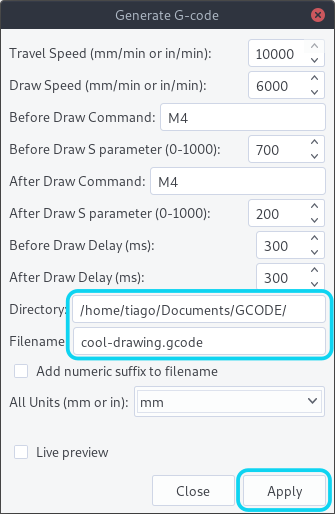

5. Click `Apply` to start the script.  For complex drawings it may take many minutes, or even hours to export the file.  While the script is running, it will display an empty dialog box.

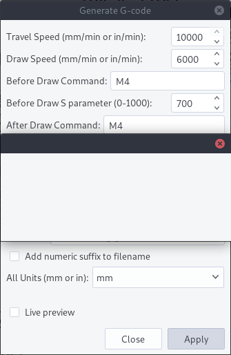

6. Once the script has finished you can check it using the [G-Code Q'n'dirty toolpath simulator](https://nraynaud.github.io/webgcode/), by dragging the file onto the page to simulate it.  As well as showing you the toolpath, it will estimate the duration of the job and show you the drawing dimensions.  Make sure the drawing x and y start at 0, and show the dimensions you were expecting (these are the dimensions of the drawing, not the page).

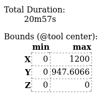

### PART 2. Drawing with Morgan

0. Power On
    1. Check morgan is plugged in, and the emergency stop button is released (twist to release).
    2. Check the Raspberry Pi is on, via the on/off switch on the side of the box.
    3. Check the green led on the side of the box is on.  If the yellow is on instead, flip the small switch next to it.

1. Open CNCjs
    - Note: If you have just switched on the Raspberry Pi you may need to wait a few minutes for CNCjs to start.
    1. Connect to the `PLOTTER` wifi. password: `plotter00`
    2. In the browser (chrome or firefox) go to the address `morgan:8000` It should load the CNCjs interface.

2. Open the Serial Connection
    - If the machine is not already connected, click `Open` in the connection widget.
    - The firmware selected should be `Grbl`.
    - The port should be `/dev/ttyS0` and the baud rate `115200`.
    

3. Take Morgan Home
    1. If the machine has just been switched on or reset, click `Reset`.  You should see `Grbl 1.1f ['$' for help]` appear in the console widget.  
      
    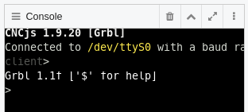  
    2. Click `Homing`, and the toolhead will first move in the X and then Y axes, until it hits the endstop switches.  Once the homing cycle has completed you should be able to use the jog controls.  
    

4. Set the Work Zero
    - You can skip this step if you are using the whole area of the machine for your drawing.
    1. Using the jog controls, move the toolhead to where you would like to put the origin of your drawing.  You can change the jog step size using the +/- buttons or the drop down menu.  
    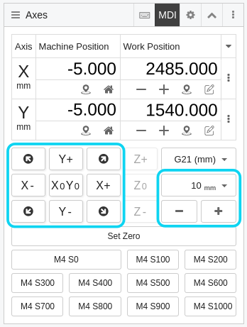  
    2. Once the toolhead is in the right position, click `Set Zero`.  The work position should now read (0,0).
    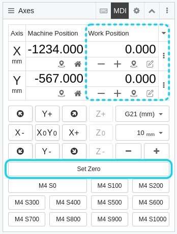

5. Set up the Pen
    - After you have set the work zero you can continue using the jog controls to move the toolhead to a comfortable position to access and adjust the pen.
    1. Move the toolhead to the pen-down position (700 by default) by sending the `M4 S700` command.  
    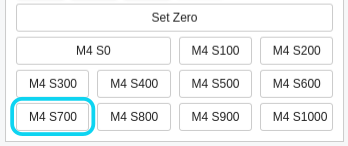  
    2. Put an empty pen holder into the toolhead, and secure it with the large screw (1).  If the pen is very large, you can put it directly into the toolhead without the extra pen-holder.  
    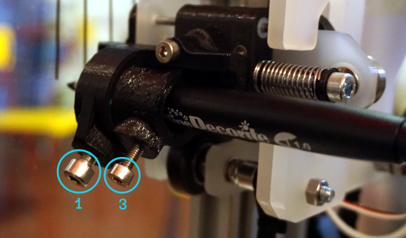  
    3. While holding the pen so that it is touching the glass/paper, and pull back the toolhead so that there is a small gap (3-4mm) between the bearing and the cam (2). Then tighten the small screw (3).  
    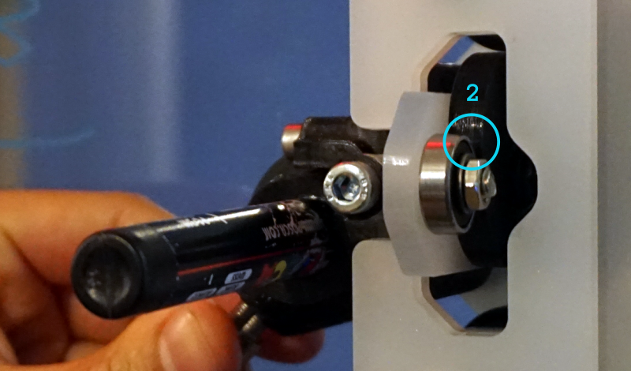  
    4. Move the toolhead to the pen-up position (200 by default) by sending the `M4 S200` command, and check that there is enough gap between the pen tip and the drawing surface.  
    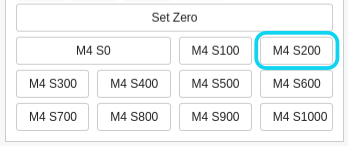

6. Upload Your G-code
    - By clicking `Upload G-code` in the preview window and selecting your file.  
    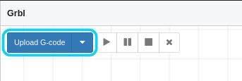  
    - The preview will show the complete toolpath, including when the pen is not drawing.
    - You can navigate the preview by clicking and dragging to pan, and scroll to zoom.
    - You can unload the G-code by clicking the `X`.

7. Start Drawing
    - If the preview looks correct click `play`.  You can pause the drawing at any time by clicking `pause` or cancel it by clicking `stop`.  
    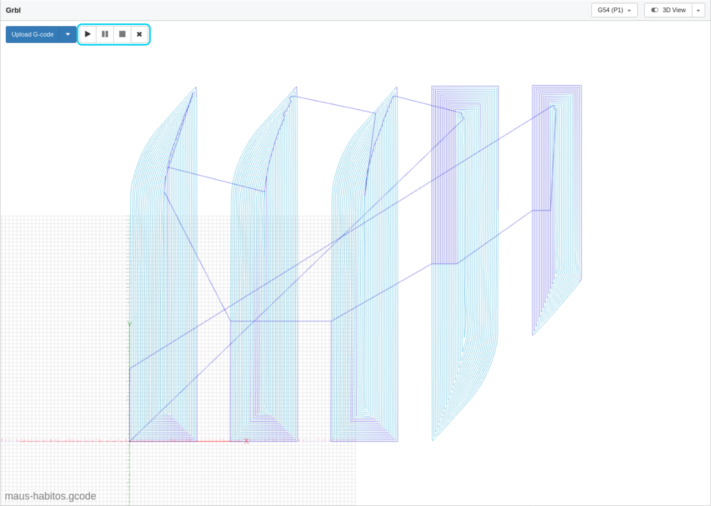

The G-code widget will also show the progress of the drawing.

### Template Files

To avoid having to manually edit the orientation points to adjust the drawing scale, you can use one of these template files. (right click and choose `Save Link As...`)

[plotter-template_A4](http://mill.pt/plotter-party/plotter-template_A4.svg)  
[plotter-template_A3](http://mill.pt/plotter-party/plotter-template_A3.svg)  
[plotter-template_1000x700](http://mill.pt/plotter-party/plotter-template_1000x700.svg)  
[plotter-template_2490x1545 (maximum drawing area)](http://mill.pt/plotter-party/plotter-template_2490x1545.svg)  

### G-code for Plotter Settings

`travel-speed, draw-speed` - The travel speed is the speed of the toolhead when it is not drawing.  The maximum comfortable speed of the machine is 10000 mm/min.

`draw-S, nodraw-S` - The pen position is controlled with the `M4` ("spindle speed") Grbl command.  The position is defined by the `S` parameter, between 1000 (fully lowered) and 0 (fully lifted).  There are serveral reasons you may want to adjust these:
    * It might be easier/quicker to adjust your gcode than to you adjust the pen itself.
    * Changing the pen pressure: By adjusting the pen position so it is drawing with a lower `S` value, the spring will be under greater compression and so will put more pressure on the pen.  Likewise, using a higher `S` value will lower the pen pressure.
    * Faster pen motions: By reducing the range of motion of the pen, these transitions will be much quicker.  This is particularly useful if doing a drawing with many small line segments.

`draw-delay, nodraw-delay` - When moving the pen, we need to add a small pause in our G-code to allow time for the pen to finish moving.
    * If the drawing has small ticks at the end of each line, it may be because the toolhead is moving before the pen has fully lifted off the drawing surface, in which case the `nodraw-delay` should be increased.
    * If there are gaps at the beginnings of lines, likewise you should increase the `draw-delay`.
    * If you have reduced the range of motion by changing the `S` parameters, you may also want to reduce these delays in order to speed up the drawing.

`add-numeric-suffix-to-filename` - Checking this box means the script will not overwrite previous exports, always creating a new file.

### Talking to Morgan via USB

There is a small switch on the side of the box to toggle the Raspberry Pi serial TX connection allowing you to connect the Arduino directly to another computer via USB.  The connection state is shown by the LEDs (green connected, for using CNCjs; yellow disconnected, for connecting via USB).

The RX connection can be received simulatneously by the Raspberry Pi and the USB Host, allowing the machine to be monitored via CNCjs even if it is being controlled by other means.

----

### HELP

### Morgan won't move, and/or the jog controls are greyed out.

If the toolhead tries to move outside of the limits of the drawing area, the machine will enter an alarm state.  This can be detected via the coordinate position (soft limits), or one of the limit switches (hard limits).

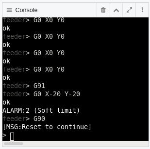
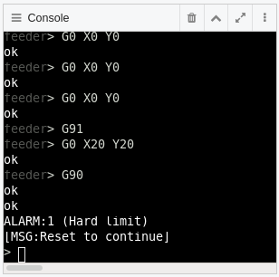

This can happen when:
  * The drawing is too large.
  * By not allowing enough space for the drawing relative to the work zero position.
  * By trying to move the toolhead outside of the drawing area with the jog commands.
  * If something obstructs the toolhead while it is working and the machine loses it's zero reference.

Whenever this happens, you need to reset the machine and redo the homing cycle.  You will lose the work zero and will have to define it again.

### Morgan made loud noises so I hit the emergency stop.

The machine can try to move outside of the draw area in the negative direction if it lost its zero reference, or there could be something else obstructing its motion.  In either case the belts will start slipping on the motor pulleys which will make a fair bit of noise.

If nobody got hurt in the process, this is fine :). Just restart the machine and follow the normal reset and homing cycle.

### The pen is drawing the paths between lines, instead of the lines themselves

The pen-up and pen-down positions in your gcode are inverted.  You need to swap the `draw-S` and `nodraw-S` values in your G-code for Plotter settings, or you can swap these by doing some find-and-replace actions on your g-code in a text editor.

### The pen only drew on part of the window/paper

The drawing surface is never completely flat and level relative to the machine gantry, so you need to allow for some variability in the drawing position of the pen.  This is why you need to allow for a small gap between the bearing and servo cam when adjusting the pen position. (see step 5.)
Try readjusting the pen position so that this gap is slightly larger.

### The scale or rotation of the drawing is wrong

This can be caused by the orientation points in Inkscape.  Ensure that the left-most point is at (0,0), and the right is at (100,0):
1. Double-click the points to enter the group.
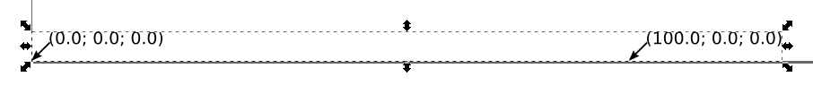

2. Select the point you want to edit, and check its position in the tool control bar. Make sure the units are in mm.
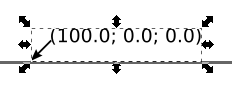

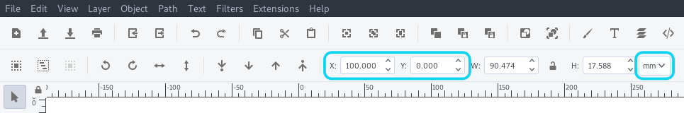

3. When you are done, double-click the background to exit the group.
Do not ungroup the orientation points, or the script will not be able to find them and will create new ones.

### There are lines missing in the drawing

If there are lines missing from the drawing, or other strange artefacts, try making sure all paths are ungrouped in Inkscape and export your G-code again.  After ungrouping everything, select all your lines and make sure they are converted to paths (`Path > Object to Path`).

### The preview in CNCjs is in 3D and I cannot pan.

Make sure the mouse control is set to `Move the Camera` in order to pan the view (1).  You can return to a 2D view by selecting the top view shortcut (2) (you may need to select another view first).
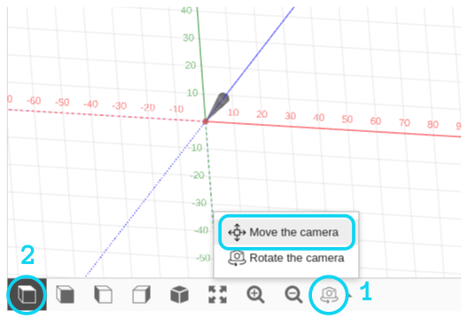

